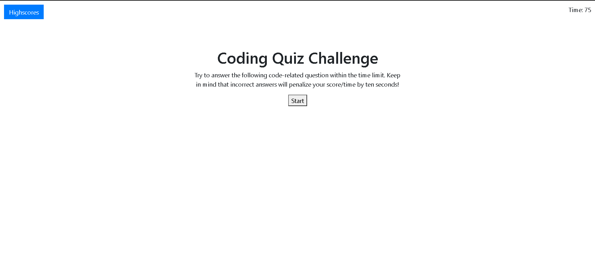

# 04-Code-Quiz

## Link to Website
https://john-paul-grace.github.io/04-Code-Quiz/

## Description

This website quizzes the user on some javascript questions. It currently has five questions and will score players based on their remaining time after they finish the quiz. The top five highscores are displayed in a scoreboard along with the responsible players' initials.

## Contributions

I used the Bootstrap grid system and button group components. I also used Jquery. All of the included code was done by me. The questions were taken from the demo gif included with the homework.

## Screenshots

---

---
